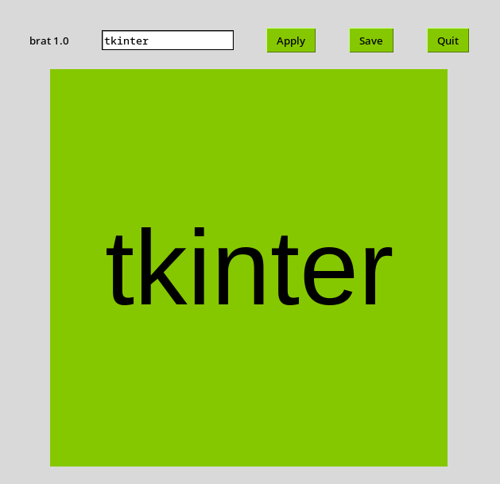

# "brat" renderer
## draws text on a green square with python & tkinter
<div style="display: flex">
    </img>
    </img>
</div>

### install
```sh
pip install -r requirements.txt
python main.py
```
___
> ### bumpin' that
